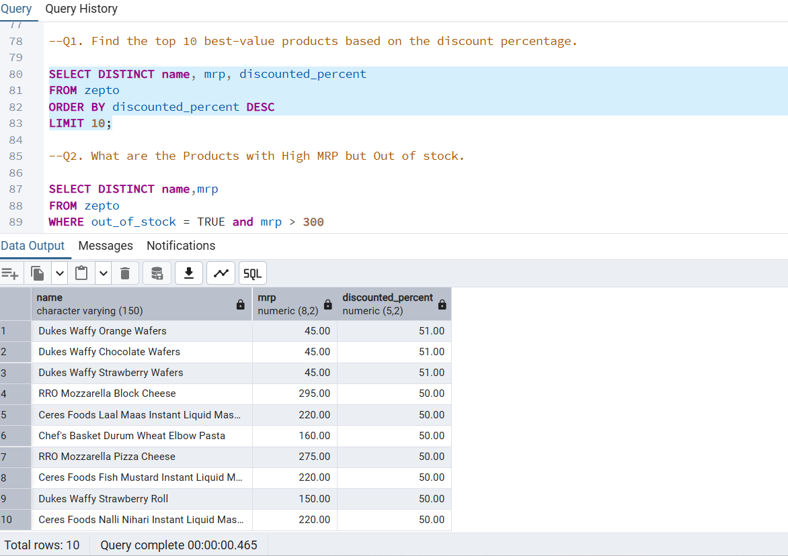
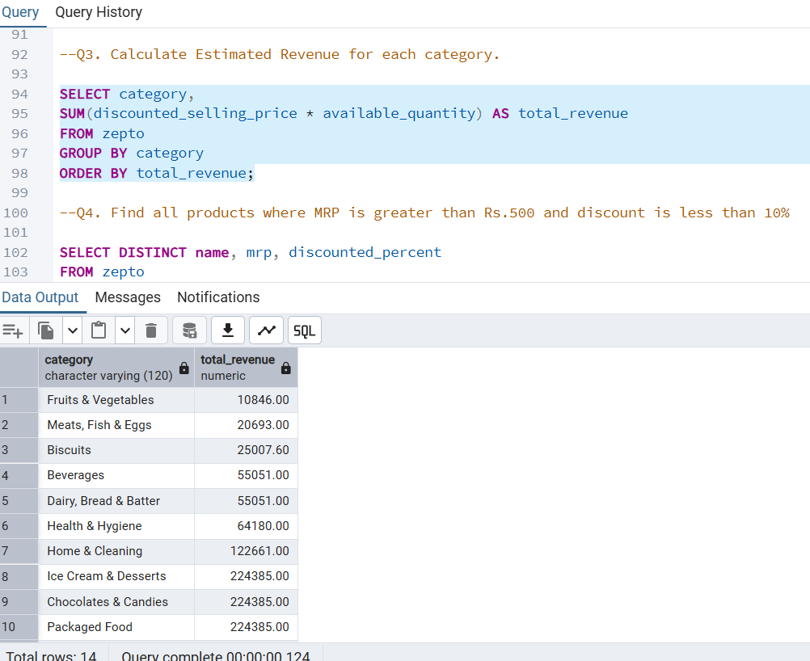
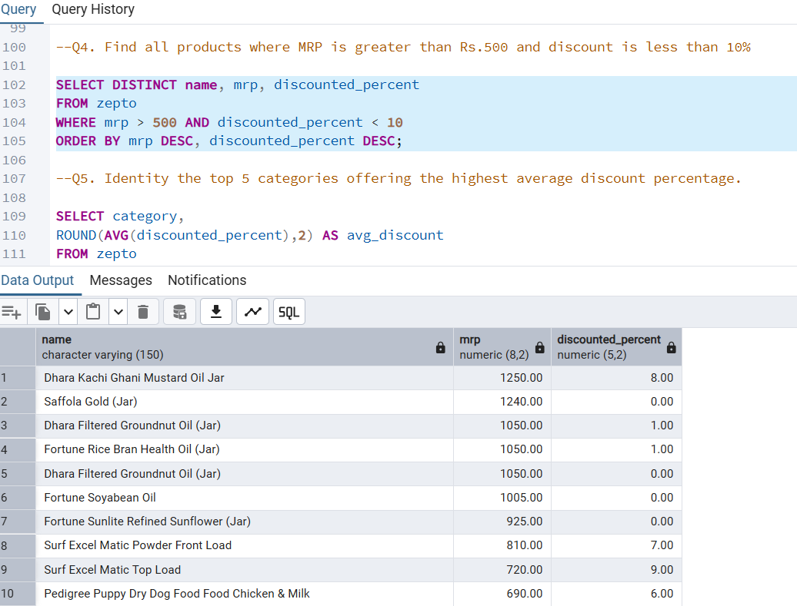
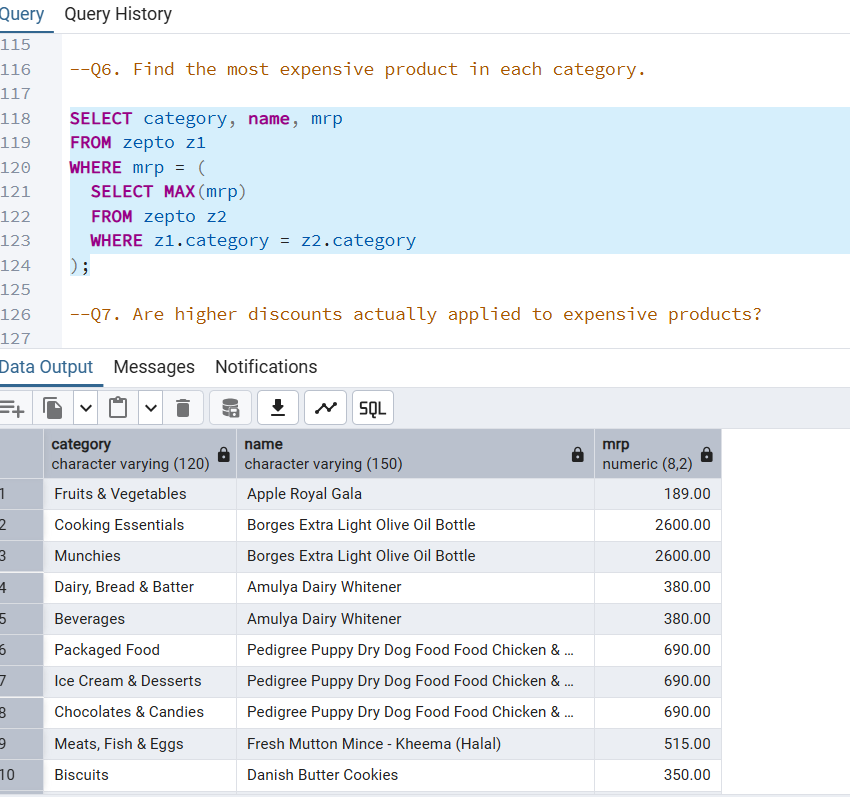

#Zepto Inventory and Pricing Analysis using SQL

## Project Overview
This Project leverages SQL to perform an in-depth analysis of Zepto's product dataset, uncovering key insights into pricing strategies, discount distribution and inventory trends generating meaningful business insights. It includes data cleaning, exploratory analysis and business based queries.

## Objectives
To explore and analyze product data to uncover insights related to
-Pricing patterns
-Identify high-value and high_discount products and strategies
-stock availability
-Understand category trends
-Generate business insights

## Tools Used
-PostgreSQL
-pgadmin
-SQL

## Key Analysis
Products with Higher-MRP tend to have higher discounts
-Some products are frequently out of stock
-Discount analysis
-Price difference analysis and pricing inconsistencies
-Revenue estimation
-Category-wise insights.

## Dataset
-Source: Kaggle(Zepto inventory dataset)

## Key Insights
-Discount % is not directly proportional to product price
-Higher-priced products provide greater absolute discount value
-Discounts are influenced by marketing analysis
-Inventory gaps identified through stock analysis.

## Skills Demonstrated
-Data exploration
-Data cleaning
-SQL Queries
-Data Analysis

## Files
-zepto_data.csv
-zepto_queries.sql

## Project Screenshots
Below are sample query outputs from the analysis:

